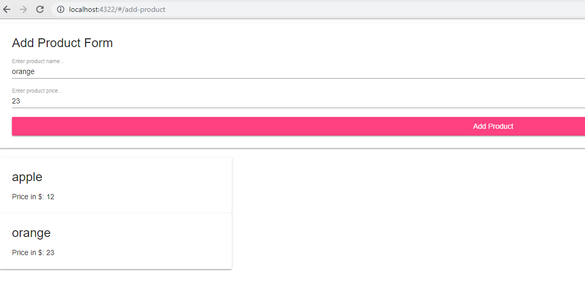
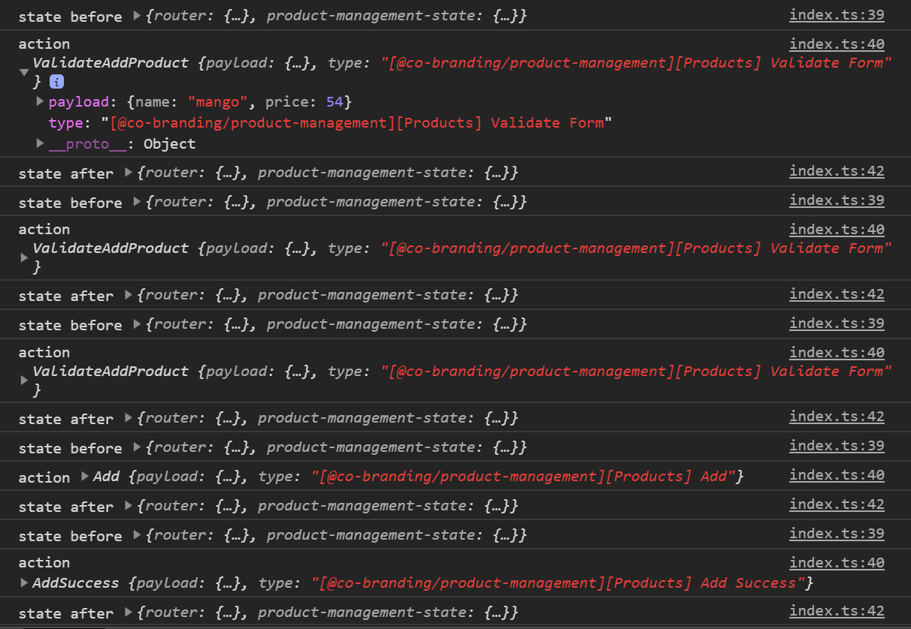

# Working with Angular Ngrx Project

This is an example to show how state management can be done using `ngrx` in angular project.

## How to get Source Code

In order to get started please execute below script on your local box.

    git clone https://github.com/roopkt/product-management.git
    cd product-management
    npm i
    npm start

## Working in example-app

### Start Example App

In order to start example app please run below cli command and navigate to `http://localhost:4322/` url.

    npm start

### Add Product Page

### Actions in Log

### Test Example App

    npm run example:test

### Creating a module

Suppose I want to create products module in eample app. Here is the cli command:

    ng g m products

### Creating a container component

suppose I have a feature module called as `products` and now I want to create an `add product container component` inside it. Here is the cli command for that:

    ng g c products/containers/add-product-container

### Creating a component

    ng g c products\components\product-image

## Working in lib

Lib is the module where we will create our components and share it with `example-app`

### Running Tests in Single Time

    npm run lib:test:sr

### Running Tests in Watch Mode

    npm run lib:test

### Run tests in chrome

    lib:test:chrome

## Angular Cli Scripts for LIB app

### Creating Module in Lib

    ng g m items --app=lib

### Creating Component in Lib

    ng g c containers\product-image-container --app=lib

### Consuming library Module

This module is a feature library therefore

    import in appmodule
    import { FeatureModuleModule } from '@co-branding/product-management';

    @NgModule({
    imports: [
        ...
        FeatureModuleModule.forFeature({ baseUrl: 'someurl' }),
    ],
    ...
    })
    export class AppModule { }

### Consuming library components

    import { Component, OnInit } from '@angular/core';

    @Component({
    template: `
    <pm-add-product-container></pm-add-product-container>
    `,
    })
    export class HomeContainerComponent implements OnInit {
    constructor() {}

    ngOnInit() {}
    }
